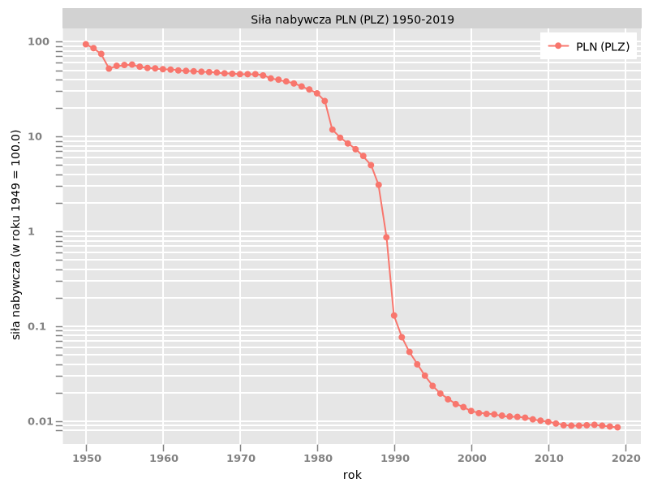
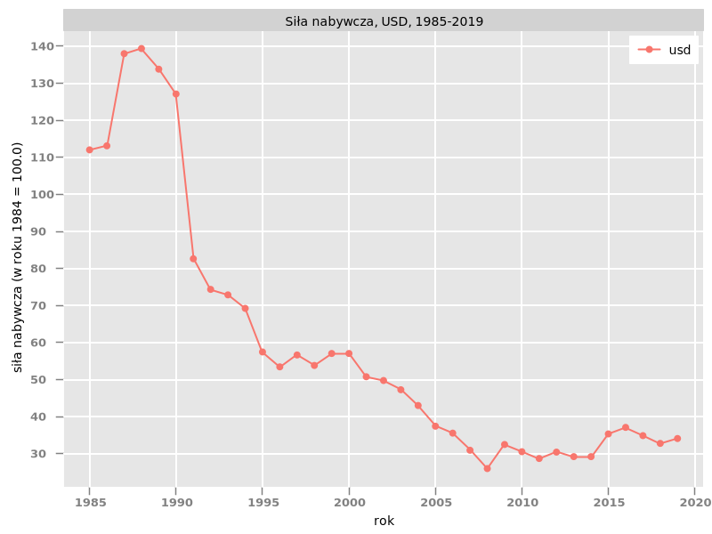
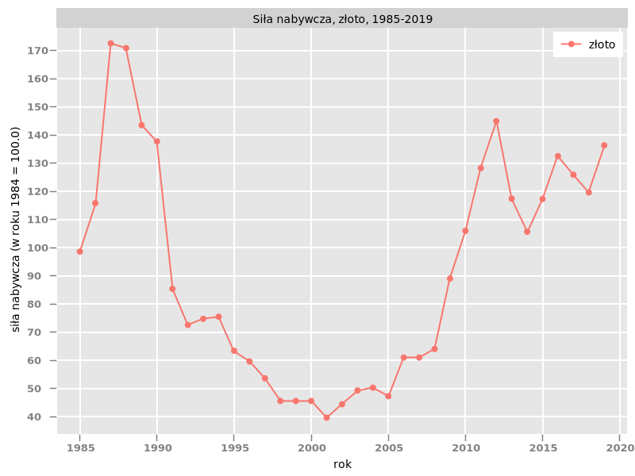
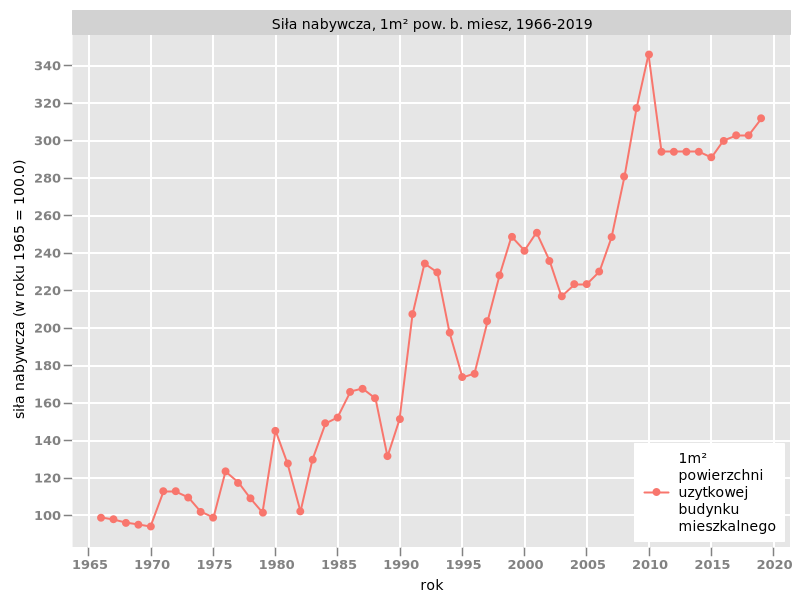
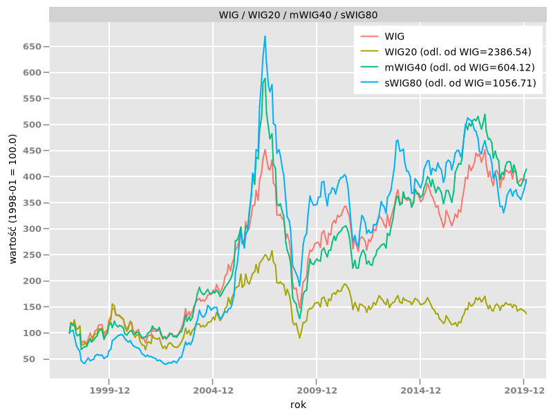
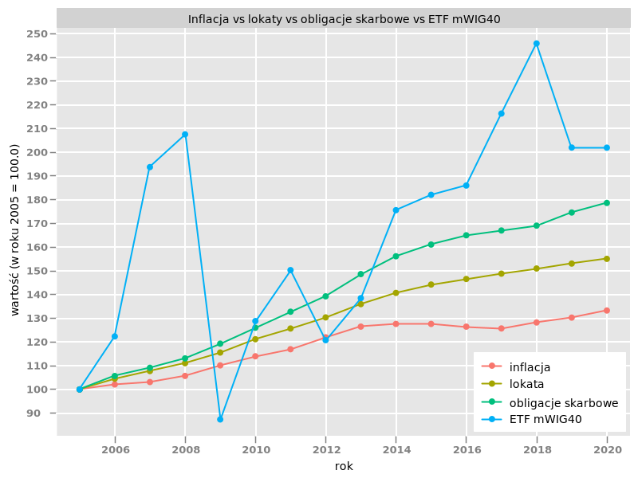

# Retirement strategies, charts

This repository showcases how to use the xcharts library in a Kotlin-Gradle project to create images containing charts. Charts present (1) changes in purchasing power of given goods like cash (PLZ/PLN, USD), gold and real estates in Poland, and (2) to what extend term deposits, government bonds, and hypothetical mWIG40 ETF protect the holder against inflation, also in Poland. Additional description in polish is added as it might concern polish readers.

## Strategie emerytalne, wykresy 

Poniższe wykresy prezentują zmianę siły nabywczej dóbr takich jak gotówka (PLZ/PLN, USD), złoto i nieruchomości, a także w jakim stopniu lokaty terminowe, obligacje skarbu państwa i hipoteczny mWIG40 ETF chronią posiadacza przed inflacją. Mogą one stanowić pomoc przy tworzeniu strategii emerytalnej przez osobę mieszkająca w Polsce i zarabiającą w polskim złotym.

### Zmiany siły nabywczej

#### PLN (PLZ)

#### USD

#### Złoto

#### Nieruchomości

### Ochrona przed inflacją

#### Indeks giełdowy najlepiej odwzorowujący cały rynek (i.e. WIG)

#### Lokaty vs obligacje skarbowe vs mWIG40 ETF

### Uwagi

